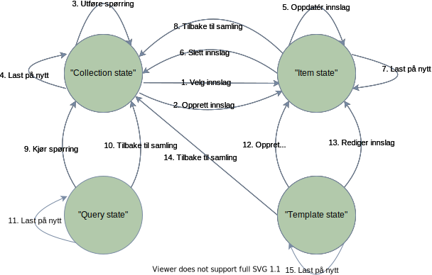
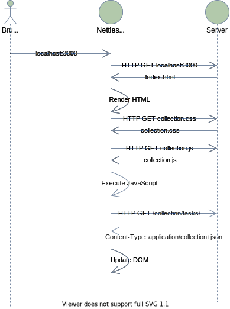

# Building Hypermedia APIs with HTML5 and Node

Personal notes from reading [https://github.com/mamund/Building-Hypermedia-APIs](https://github.com/mamund/Building-Hypermedia-APIs)

## Chapter 3 - JSON hypermedia

<details>
<summary>Installation notes</summary>

### Installation notes

#### Prerequisites

- Docker
- Node
- WSL

#### CouchDB in WSL

```bash
# In WSL
docker run -p 5984:5984 -d --name my-couchdb couchdb:2.3.1
```

Verify installation by going to [http://127.0.0.1:5984/_utils/#/verifyinstall](http://127.0.0.1:5984/_utils/#/verifyinstall)

#### Initialize data

```bash
# In WSL
cd /home/thomas/dev/github.com/other/Building-Hypermedia-APIs/couchdb/collection
./collection_data.sh
```

#### Start server

##### Edit `nodejs\collection\node_modules\connect\lib\middleware\bodyParser.js`

Open `C:\Dev\github.com\Building-Hypermedia-APIs\nodejs\collection\node_modules\connect\lib\middleware\bodyParser.js` and replace line 88 with:

```js
var parser = exports.parse[mime(req) === "application/collection+json" ? "application/json" : mime(req)];
```

```bash
# In Windows PowerShell
cd C:\Dev\github.com\Building-Hypermedia-APIs\nodejs\collection
node app.js
# Should output 'Express server listening on port 3000'
```

#### Open client

Open [http://localhost:3000](http://localhost:3000) to view `Collection+JSON` client.

</details>

### Presentation notes

#### Use case

Lage en hypermediatype for å støtte lese- og skriveoperasjoner for samlinger av "ting" (f.eks. oppgaveliste).

#### Design av hypermediatypen

Betraktninger av de ulike dimensjonene av en hypermediatype som gjøres fra klientenes perspektiv.

##### Dataformat

Ettersom klientene skal skriver i JavaScript, brukes JSON som dataformat. Dette gjør det enkelt å behandle dataene i JavaScript.

##### Tilstandsoverganger ("state transitions")

###### Hva skal tilstandene inneholde?

- Samlingen av "ting"
- Et enkelt innslag i samlingen
- Liste med mulige spørringer man kan gjøre mot samlingen
- Mal for å legge til eller redigere innslag i samlingen
- Feildetaljer

###### Aktuelle tilstander

- "Collection state"
  - Samlingen av "ting"
  - Spørringer
  - Mal for å opprette innslag
- "Item state"
  - Et enkelt innslag
  - Spørringer
  - Mal for å redigere innslaget
- "Error state"
  - Detaljer om den nyeste feilen som oppstod

###### Tilstandsoverganger

- "Collection state"
  - 1 - Velge enkeltinnslag ("Item state")
  - 2 - Legge til enkeltinnslag ("Item state")
  - 3 - Utføre spørring ("Collection state")
  - 4 - Last samlingen på nytt ("Collection state")
- "Item state"
  - 5 - Oppdatere innslaget ("Item state")
  - 6 - Slette innslaget ("Collection state")
  - 7 - Hent innslaget på nytt ("Item state")
  - 8 - Gå tilbake til samlingen ("Collection state")
- "Query state"
  - 9 - Kjøre spørring ("Collection state")
  - 10 - Gå tilbake til samlingen ("Collection state")
  - 11 - Hent spørringene på nytt ("Query state")
- "Template state"
  - 12 - Legge til enkeltinnslag ("Item state")
  - 13 - Oppdatere enkeltinnslag ("Item state")
  - 14 - Gå tilbake til samlingen ("Collection state")
  - 15 - Last malen på nytt ("Template state")



###### Hva slags type tilstandsovergang skal vi ha?

Hvilke mønstre kan vi velge mellom?

- "Read only" - klienter trenger ikke å overføre data til server, kun hente data. Eksempel: `SVG11`.
- "Predefined" - har behov for tilstandsoverganger initiert av klient. Tilstandsovergangene er spesifisert og dokumentert. Eksempel: `AtomPub`.
- "Ad-hoc" - tilstandsovergangene ligger i hypemediameldingen i seg selv. Eksempel: `HTML` (`form`,            `input`).

Velger predefinert ettersom det er et begrenset antall med tilstandsoverganger. Enkelt å finne HTTP metode som passer med handlingene man ønsker å gjøre:

- CReate -> `HTTP POST`
- Update -> `HTTP PUT`
- Delete -> `HTTP DELETE`

##### Domenestil

Ettersom hypermediatypen er ment å kunne brukes til ulike domener, passer det med en generisk domenestil. Navnene på egenskapene i modellen kan være generiske, og så kan semantisk informasjon ligge i lenkene (f.eks. `rel="shopping-list` ).

##### Applikasjonsflyt

Hvilke kan vi velge mellom?

- Ingen
- Iboende ("Intrinsic") - eksplisitte lenkerelasjoner til handlinger som er bygd inn i hypermediatypen. Eksempel: `Atom` og `AtomPub`
- Anvendt ("Applied") - Applikasjonsflyt er ikke en del av hypermediatypen, men designet inneholder "allowances". Eksempel: `HTML`

I vårt tilfelle kan applikasjonsflyten bygges direkte inn i hypemediatypen: hvilke handlinger som til enhver tid er tilgjengelig trenger ikke å forklares utenfor designet i seg selv.

##### Format på respons

_Vis `collection+json.schema.json` og `tasks.example.json`_

#### Server

`Node`-applikasjon laget med:

- `Express.js`
- `ejs` (_Embedded JavaScript templates)
- `CouchDb`

#### HTML-klient

JavaScript-applikasjon som har innebygd forståelse av `Collection+JSON` -hypermedia-formatet. Forøvrig er den eneste koblingen mellom klient og server at klienten har en forhåndsbestemt URL for å nå serveren.

##### Sekvensdiagram



#### CLI-klient

`Node`-applikasjon som leser mal fra server, og oppretter nye oppgaver vha. HTTP POST.

#### Demo

##### Dokumentasjon

- [http://localhost:3000/docs](http://localhost:3000/docs)

##### Demo av HTML-klient

- [http://localhost:8080/](http://localhost:8080/)

##### ThunderClient

###### Leseoperasjoner

- HTTP GET `http://localhost:3000/collection/tasks/`
- HTTP GET `http://localhost:3000/collection/tasks/task1`
- HTTP GET `http://localhost:3000/collection/tasks/;queries`
- HTTP GET `http://localhost:3000/collection/tasks/;template`
- HTTP GET `http://localhost:3000/collection/tasks/;all`
- HTTP GET `http://localhost:3000/collection/tasks/;open`
- HTTP GET `http://localhost:3000/collection/tasks/;closed`
- HTTP GET `http://localhost:3000/collection/tasks/;dueDate`
- HTTP GET `http://localhost:3000/collection/tasks/;date-range?date-start=2011-01-01&date-stop=2011-12-31`

###### Skriveoperasjoner

HTTP POST til `http://localhost:3000/collection/tasks/` med body (av en eller annen grunn blir denne kjørt 10 ganger med ThunderClient)

```json
{
  "template": {
    "data": [
      {
        "name": "description",
        "value": "My other task"
      },
      {
        "name": "dateDue",
        "value": "2022-12-31"
      },
      {
        "name": "completed",
        "value": "false"
      }
    ]
  }
}
```

HTTP PUT til `http://localhost:3000/collection/tasks/` med body:

```json
{
  "template": {
    "data": [
      {
        "name": "description",
        "value": "My other task (done)"
      },
      {
        "name": "dateDue",
        "value": "2022-12-31"
      },
      {
        "name": "completed",
        "value": "true"
      }
    ]
  }
}
```

HTTP DELETE til `http://localhost:3000/collection/tasks/task1` med `if-match=<revision fra basen>`
